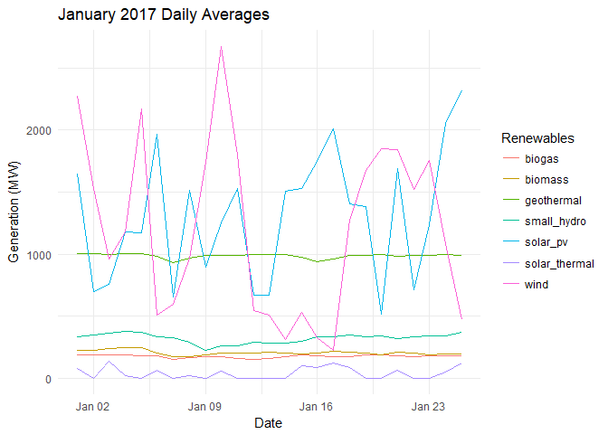
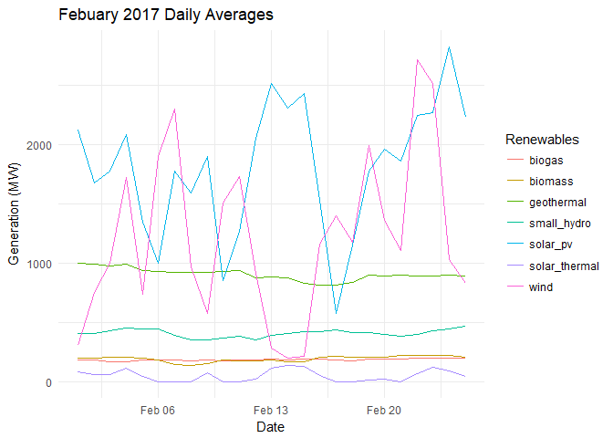
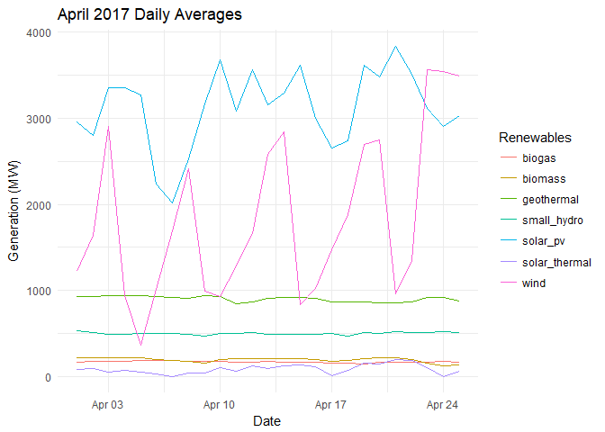
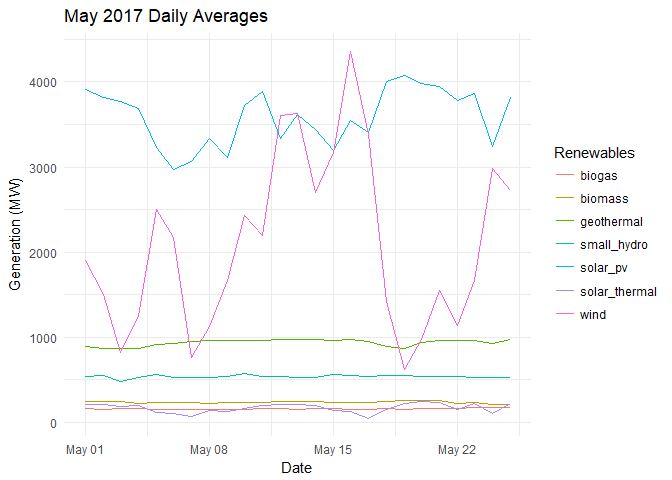
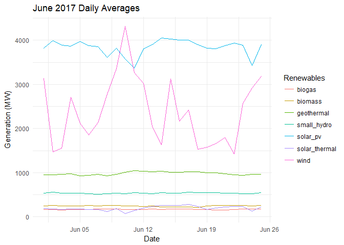
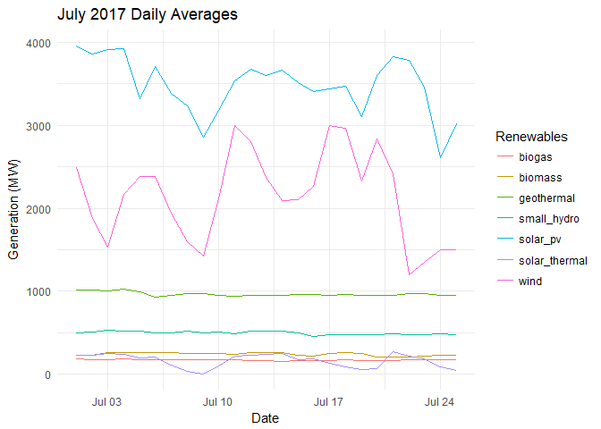
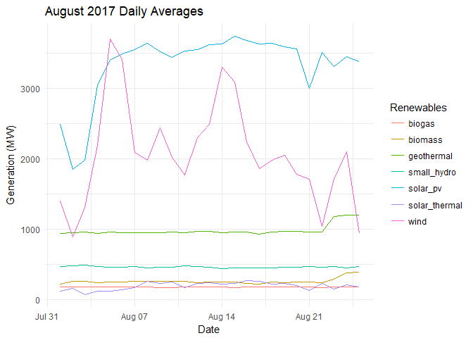
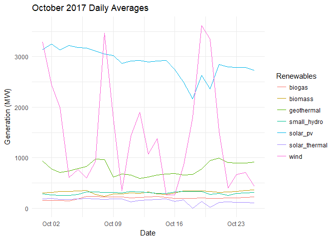
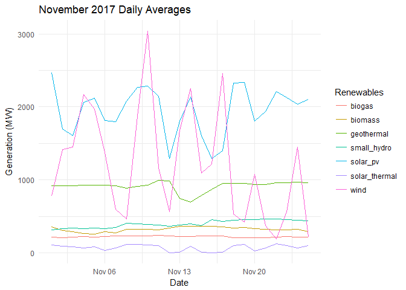

California ISO Electric Grid Data Analysis
================
Michaela Palmer & Melissa Ferriter

``` r
knitr::opts_chunk$set(echo = T, warning = F, message = F)
```

``` r
libs <- c("tidyverse", "readxl", "foreign", "zoo")
sapply(libs, require, character.only=T)
```

Read in data
------------

The data used in this analysis comes from [California Independent System Operator Corporation (CAISO)](http://www.caiso.com/green/renewableswatch.html), which aggregates grid data from electricity producers in California.

``` r
# create and view an object with file names & full paths
days <- c(paste0("0", 1:9), 10:25)
months <- c(paste0("0", 1:9), "10", "11", "12")

urls <- list()
for (i in months) {
  url <- paste0("http://content.caiso.com/green/renewrpt/2017", i, days,"_DailyRenewablesWatch.txt")
  urls[[paste0("month", i)]] <- url
}
```

We are going to be reading in the CAISO data by month for 2017. However, We have to be aware that this is unverified raw data that contains errors. Consequently, we chose to remove March 2017 due to the error: "The supplied DateTime represents an invalid time. For example, when the clock is adjusted forward, any time in the period that is skipped is invalid."

``` r
# function to import data with proper formatting & columns 
import <- function(data) {
  data.frame(date = as.Date(basename(data), "%Y%m%d"), read_table2( 
    data,
    col_names = c("hour", "geothermal", "biomass", "biogas", "small_hydro", "wind", "solar_pv", "solar_thermal" ),
    skip = 2,
    n_max = 24
  )) 
}

jan <- do.call("rbind", lapply(urls[["month01"]], import))
feb <- do.call("rbind", lapply(urls[["month02"]], import)) 
april <- do.call("rbind", lapply(urls[["month04"]], import)) 
may <- do.call("rbind", lapply(urls[["month05"]], import)) 
june <- do.call("rbind", lapply(urls[["month06"]], import))
july <- do.call("rbind", lapply(urls[["month07"]], import))
august <- do.call("rbind", lapply(urls[["month08"]], import))
oct <- do.call("rbind", lapply(urls[["month10"]], import))
nov <- do.call("rbind", lapply(urls[["month11"]], import))
```

When reading in the dates from the urls, we tested out other regular expressions methods. These methods below work, but we decided to pursue a different method for sake of conciseness.

``` r
sub(".*(\\d{8}).*", "\\1", urls)
```

    ##  [1] "20170125" "20170225" "20170325" "20170425" "20170525" "20170625"
    ##  [7] "20170725" "20170825" "20170925" "20171025" "20171125" "20171225"

``` r
sub(".*/", "", sub("_.*", "", urls))
```

    ##  [1] "20170101" "20170201" "20170301" "20170401" "20170501" "20170601"
    ##  [7] "20170701" "20170801" "20170901" "20171001" "20171101" "20171201"

``` r
gsub("(?:.*/){4}([^_]+)_.*", "\\1", urls)
```

    ##  [1] "20170125" "20170225" "20170325" "20170425" "20170525" "20170625"
    ##  [7] "20170725" "20170825" "20170925" "20171025" "20171125" "20171225"

Daily average data plots
========================

The CAISO data are provided at hourly intervals. Plotting the data for the entire 6-year period would have generated a very messy graph, so we calculated daily means and plotted them.

``` r
month.list <- list(January=jan, Febuary = feb, April=april, May=may, June=june, July=july, August=august, October=oct, November=nov)
plot <- function(data, name) {
  data[,-c(2)] %>%
    read.zoo(FUN = identity) %>%
    aggregate(as.Date, mean) %>%
    fortify.zoo() %>%
    select(Index, geothermal, biomass, biogas, small_hydro, wind, solar_pv, solar_thermal) %>%
    gather(Renewables, mean,-Index) %>%
    ggplot() +
    geom_line(mapping = aes(x = Index, y = mean, color = Renewables)) + 
    labs(title = paste(name, "2017 Daily Averages", sep = " "), x = "Date", y = "Generation (MW)") + theme_minimal()
}

plot.list <- Map(plot, data = month.list, name = names(month.list))
plot.list
```

    ## $January



    ## 
    ## $Febuary



    ## 
    ## $April



    ## 
    ## $May



    ## 
    ## $June



    ## 
    ## $July



    ## 
    ## $August



    ## 
    ## $October



    ## 
    ## $November



We are going to further explore seasonality/time series anaylsis because summer irradiance &gt; winter. Assumptions: -Jan-Feb = Winter -April-May = Spring -June-Aug = Summer -Oct-Nov = Fall
