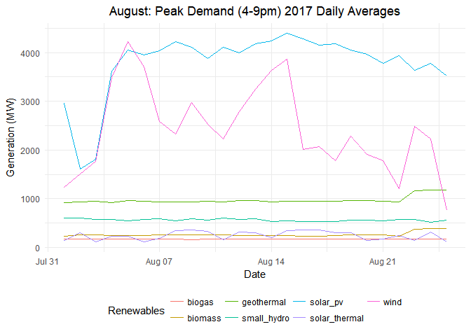
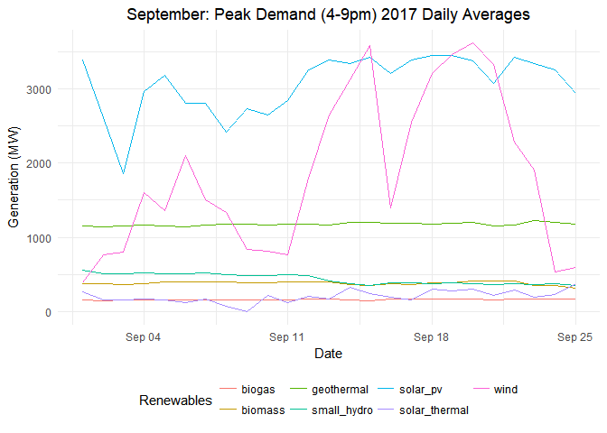

California ISO Electric Grid Data Analysis
================
Michaela Palmer & Melissa Ferriter

``` r
knitr::opts_chunk$set(echo = T, warning = F, message = F)
```

``` r
libs <- c("tidyverse", "foreign", "zoo", "ggpubr")
sapply(libs, require, character.only=T)
```

``` r
theme_set(theme_minimal()) # Set theme to theme_minimal as base
# Edit somoe of the parameters in the minimal theme
theme_update(plot.title = element_text(hjust=0.5))
```

Data preparation and reading
----------------------------

The data used in this analysis comes from [California Independent System Operator Corporation (CAISO)](http://www.caiso.com/green/renewableswatch.html), which aggregates grid data from electricity producers in California.

``` r
# Create and view an object with file names & full paths
days <- c(paste0("0", 1:9), 10:25)
months <- c(paste0("0", 1:9), "10", "11", "12")

urls <- list()
for (i in months) {
  url <- paste0("http://content.caiso.com/green/renewrpt/2017", i, days,"_DailyRenewablesWatch.txt")
  urls[[paste0("month", i)]] <- url
}
```

We are going to be reading in the CAISO data by month for 2017. However, We have to be aware that this is unverified raw data that contains errors. Consequently, we chose to remove March 2017 due to the error:

`"The supplied DateTime represents an invalid time. For example, when the clock is adjusted forward, any time in the period that is skipped is invalid."`

``` r
# Function to import data with proper formatting & columns 
import <- function(data) {
  data.frame(date = as.Date(basename(data), "%Y%m%d"), read_table2( 
    data,
    col_names = c("hour", "geothermal", "biomass", "biogas", "small_hydro", "wind", "solar_pv", "solar_thermal" ),
    skip = 2,
    n_max = 24
  )) 
}

jan <- do.call("rbind", lapply(urls[["month01"]], import))
feb <- do.call("rbind", lapply(urls[["month02"]], import)) 
april <- do.call("rbind", lapply(urls[["month04"]], import)) 
may <- do.call("rbind", lapply(urls[["month05"]], import)) 
june <- do.call("rbind", lapply(urls[["month06"]], import))
july <- do.call("rbind", lapply(urls[["month07"]], import))
aug <- do.call("rbind", lapply(urls[["month08"]], import))
sept <- do.call("rbind", lapply(urls[["month09"]], import))
oct <- do.call("rbind", lapply(urls[["month10"]], import))
nov <- do.call("rbind", lapply(urls[["month11"]], import))
```

To solve for the missing data issue in March, we are going to generate random values using the min and max generation values of the other spring months values, April and May.

``` r
april %>%
  select(everything(), -hour, -date) %>%
  lapply(min) -> april.mins
may %>% 
  select(everything(), -hour, -date) %>%
  lapply(min) -> may.mins
april %>% 
select(everything(), -hour, -date) %>%
  lapply(max) -> april.maxs
may %>%
  select(everything(), -hour, -date) %>%
  lapply(max) -> may.maxs

mins <- bind_rows(april.mins, may.mins)
maxs <- bind_rows(april.maxs, may.maxs)
mins <- lapply(mins, mean)
maxs <- lapply(maxs, mean)

vals <- function(source){
  round(runif(600, min = mins[[source]], max = maxs[[source]]),0)
}

sources <- c("geothermal", "biomass", "biogas", "small_hydro", "wind", "solar_pv", "solar_thermal")
march <- data.frame(date = seq(as.Date("2017-03-01"), as.Date("2017-03-26"), length.out = 601)) %>%
    slice(1:600)
march["hour"] <- c(1:24)

march2 <- as.data.frame(lapply(sources, vals), col.names = sources)
march <- bind_cols(march, march2)
```

When reading in the dates from the urls, we tested out other regular expressions methods to access the year, month, a day from the `.txt` file. These regex methods below work, but we decided to pursue the `as.Date` function in base R for sake of conciseness.

``` r
sub(".*(\\d{8}).*", "\\1", urls[["month01"]])
```

    ##  [1] "20170101" "20170102" "20170103" "20170104" "20170105" "20170106"
    ##  [7] "20170107" "20170108" "20170109" "20170110" "20170111" "20170112"
    ## [13] "20170113" "20170114" "20170115" "20170116" "20170117" "20170118"
    ## [19] "20170119" "20170120" "20170121" "20170122" "20170123" "20170124"
    ## [25] "20170125"

``` r
gsub("(?:.*/){4}([^_]+)_.*", "\\1", urls[["month01"]])
```

    ##  [1] "20170101" "20170102" "20170103" "20170104" "20170105" "20170106"
    ##  [7] "20170107" "20170108" "20170109" "20170110" "20170111" "20170112"
    ## [13] "20170113" "20170114" "20170115" "20170116" "20170117" "20170118"
    ## [19] "20170119" "20170120" "20170121" "20170122" "20170123" "20170124"
    ## [25] "20170125"

``` r
gsub("\\D", "", urls[["month01"]])
```

    ##  [1] "20170101" "20170102" "20170103" "20170104" "20170105" "20170106"
    ##  [7] "20170107" "20170108" "20170109" "20170110" "20170111" "20170112"
    ## [13] "20170113" "20170114" "20170115" "20170116" "20170117" "20170118"
    ## [19] "20170119" "20170120" "20170121" "20170122" "20170123" "20170124"
    ## [25] "20170125"

``` r
sub(".*/", "", sub("_.*", "", urls[["month01"]]))
```

    ##  [1] "20170101" "20170102" "20170103" "20170104" "20170105" "20170106"
    ##  [7] "20170107" "20170108" "20170109" "20170110" "20170111" "20170112"
    ## [13] "20170113" "20170114" "20170115" "20170116" "20170117" "20170118"
    ## [19] "20170119" "20170120" "20170121" "20170122" "20170123" "20170124"
    ## [25] "20170125"

``` r
sub(".*(\\d{8}).*", "\\1", urls[["month01"]])
```

    ##  [1] "20170101" "20170102" "20170103" "20170104" "20170105" "20170106"
    ##  [7] "20170107" "20170108" "20170109" "20170110" "20170111" "20170112"
    ## [13] "20170113" "20170114" "20170115" "20170116" "20170117" "20170118"
    ## [19] "20170119" "20170120" "20170121" "20170122" "20170123" "20170124"
    ## [25] "20170125"

Preparing processed data for archiving / publication
----------------------------------------------------

description of data for public

``` r
caiso17.full <- bind_rows(jan, feb, march, april, may, june, july, aug, sept, oct, nov)
write.csv(caiso17.full, file = "CAISO.full_2017.csv", row.names = F)
```

Daily average data plots - By Season
------------------------------------

The CAISO data are provided at hourly intervals. Plotting the data for each month the entire 6-year period would have generated an overwhelming number of graphs, so we first wrote a funcntion to calculate daily means and plot them.

``` r
plot <- function(data, name) {
  data[,-c(2)] %>%
    read.zoo(FUN = identity) %>%
    aggregate(as.Date, mean) %>%
    fortify.zoo() %>%
    select(Index, geothermal, biomass, biogas, small_hydro, wind, solar_pv, solar_thermal) %>%
    gather(Renewables, mean,-Index) %>%
    ggplot() +
    geom_line(mapping = aes(x = Index, y = mean, color = Renewables)) + 
    labs(title = paste(name, "2017 Daily Averages", sep = " "), x = "Date", y = "Generation (MW)") +
    theme(legend.position="bottom") 
}
```

Explore high-demand/peak periods during August and September.
-------------------------------------------------------------

Demand/peak periods during August and September.

``` r
aug %>%
  filter(hour >= 16, hour <= 21 ) %>%
  plot(name = "August: Peak Demand (4-9pm)")  
```


``` r
plot(aug, name = "August 24hr")
```


``` r
sept %>%
  filter(hour >= 16, hour <= 21 ) %>%
  plot(name = "September: Peak Demand (4-9pm)")  
```


``` r
plot(sept, name = "September 24hr")
```


Next, we are going to categorize the months' data under the four seasons. Assumptions:

-   Jan-Feb = Winter
-   April-May = Spring
-   June-Aug = Summer
-   Sept-Nov = Fall

We aggregated the months by these seasonal assumptions and plotted them below.

``` r
winter <- bind_rows(jan, feb)
spring <- bind_rows(april, may)
summer <- bind_rows(june, july, aug)
fall <- bind_rows(sept, oct, nov)
season.list <- list(Winter=winter, Spring=spring, Summer=summer, Fall=fall)
Map(plot, data = season.list, name = names(season.list))
```

    ## $Winter



    ## 
    ## $Spring


    ## 
    ## $Summer



    ## 
    ## $Fall


We can explore seasonality/time series analysis using these visualizations. Summer irradiance &gt; winter, Magnitude of generation is the least in Winter, to be expected. An interesting feature of these plots that wind generation peaks around mid-year and decreases to low generation in the winter, just like solar only more pronounced.

Peak and Super Peak Generation by Source
----------------------------------------

Next we are going to explore which sources have the most output during peak (Jan-Feb 4-9pm) and super peak (July-Aug 4-9pm) time frames. We expect that some sources will maintain constant output, while others, such as solar, will experience varied output depending on month and time of day.

``` r
## vizualize how renewables change throughout the peak and super peak periods

pk <- bind_rows(jan, feb)
spk <- bind_rows(july, aug)

peak <- pk[, -c(1)] %>%
    filter(hour >= 16, hour <= 21 ) %>%
    group_by(hour) %>%
    summarise_all(funs(mean)) %>%
    gather(Renewables, mean, -hour) %>%
    ggplot() +
    geom_line(mapping = aes(x = hour, y = mean, color = Renewables)) + 
    labs(title = "Peak Time Frame (Jan-Feb 4-9pm)", x = "Hour", y = "Generation (MW)") 

super.peak <- spk[, -c(1)] %>%
    filter(hour >= 16, hour <= 21 ) %>%
    group_by(hour) %>%
    summarise_all(funs(mean)) %>%
    gather(Renewables, mean, -hour) %>%
    ggplot() +
    geom_line(mapping = aes(x = hour, y = mean, color = Renewables)) + 
    labs(title = "Super Peak Time Frame (July-August 4-9pm)", x = "Hour", y = "Generation (MW)") 

ggpubr::ggarrange(peak + rremove("xlab") + rremove("x.text"), super.peak, nrow = 2, common.legend = T, legend = "bottom")
```


``` r
# Compare the averages over the peak and super peak time frames for each renewable
peak.avg <- pk[, -c(1)] %>%
    filter(hour >= 16, hour <= 21 ) %>%
    select(everything(), -hour) %>%
    summarise_all(funs(mean)) %>%
    gather(Renewable, "Peak Mean")

super.peak.avg <- spk[, -c(1)] %>%
    filter(hour >= 16, hour <= 21 ) %>%
    select(everything(), -hour) %>%
    summarise_all(funs(mean)) %>%
    gather(Renewable, "Super Peak Mean")

final <- merge(peak.avg, super.peak.avg, by = "Renewable")
final
```

    ##       Renewable  Peak Mean Super Peak Mean
    ## 1        biogas  182.51333        172.7400
    ## 2       biomass  205.38667        253.9900
    ## 3    geothermal  947.87667        962.9433
    ## 4   small_hydro  416.95667        579.7133
    ## 5      solar_pv  717.37667       3983.2300
    ## 6 solar_thermal   26.92667        229.8933
    ## 7          wind 1261.70000       2490.7033

``` r
# Vizualization of Peak and Super Peak averages by renewable source
final %>%
  tidyr::gather(Time, Mean, -Renewable) %>%
  ggplot(aes(x = Renewable, y = Mean, fill = Time)) + geom_bar(stat="identity", position = "dodge", width = 0.6) +
  scale_fill_brewer(palette="Set1") + guides(fill=guide_legend("Period")) + 
  labs(title = "Comparison Peak and Super Peak Renewable Generation",
    x = "Renewable Source", 
    y = "Generation (MW)") + 
    theme(legend.position = c(0.2, 0.8))
```


